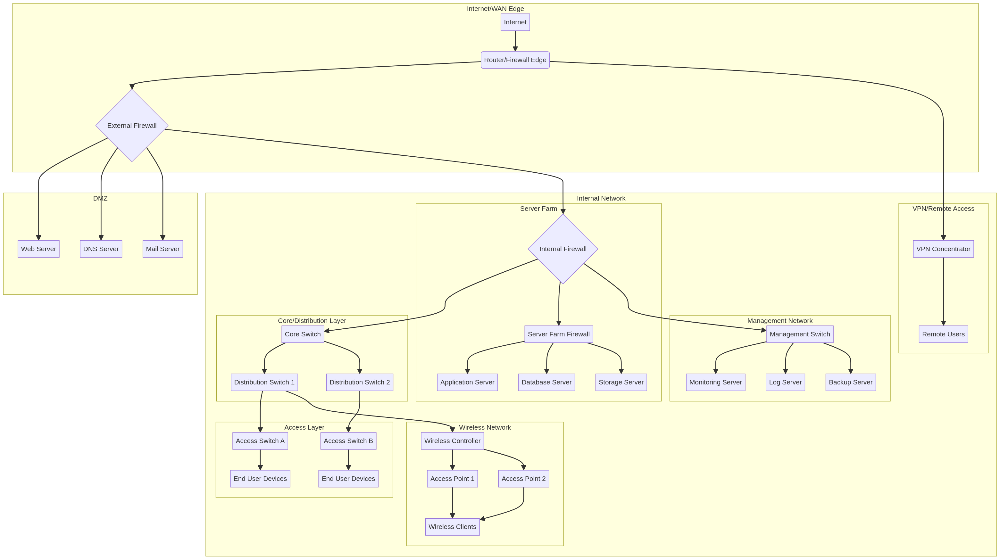
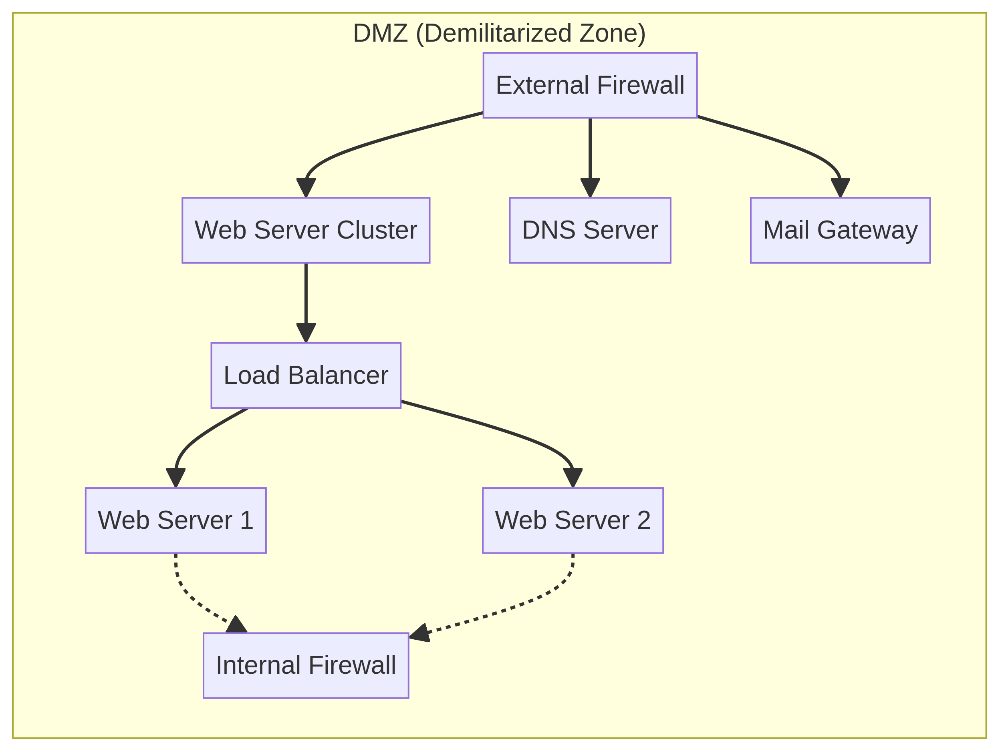
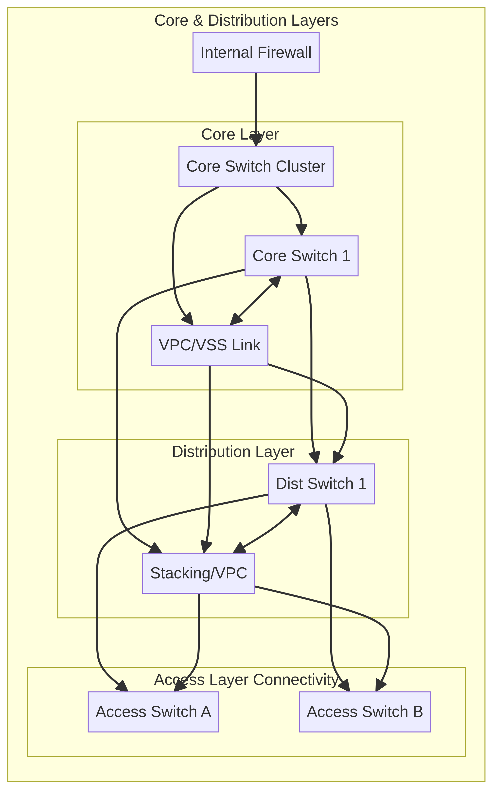
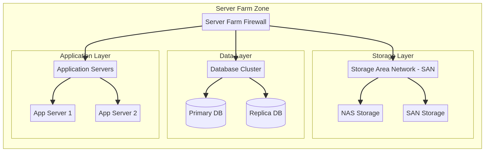
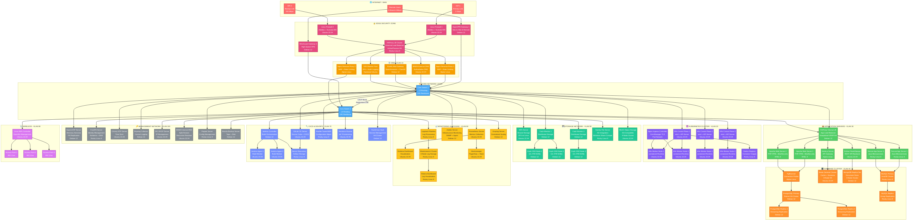

# Enterprise Network Topology

This document outlines a comprehensive enterprise network topology, designed to provide a secure, scalable, and resilient infrastructure for a modern organization. The topology incorporates various zones and layers to segment traffic, enforce security policies, and optimize performance.

## Architecture Overview

The network is logically divided into several key zones, each serving a specific purpose and protected by appropriate security controls. The primary zones include:

*   **Internet/WAN Edge**: The demarcation point between the internal network and external networks (Internet, WAN).
*   **DMZ (Demilitarized Zone)**: A buffer zone for publicly accessible services, isolated from both the Internet and the internal network.
*   **Internal Network**: The core of the enterprise network, further segmented into core, distribution, and access layers.
*   **Server Farm**: A dedicated zone for critical application and database servers.
*   **Management Network**: A separate, secure network for managing network devices and servers.
*   **Wireless Network**: Provides secure wireless connectivity for internal users.
*   **VPN/Remote Access**: Enables secure remote access for users outside the corporate network.

### Full Network Topology Diagram

Below is the complete enterprise network topology diagram, illustrating the interconnectedness of all zones and components.

## Network Zones and Components

### Internet/WAN Edge

This zone represents the entry and exit point for all external traffic. It is critical for establishing a secure perimeter.

*   **Internet**: The external network.
*   **Router/Firewall Edge**: The primary device at the network edge, responsible for routing external traffic and providing initial firewall protection.
*   **External Firewall**: A robust firewall that enforces security policies between the Internet/WAN Edge and the DMZ/Internal Network, performing deep packet inspection and intrusion prevention.

### DMZ (Demilitarized Zone)

The DMZ hosts services that need to be accessible from the Internet but should not have direct access to the internal network. This isolation minimizes the risk of external attacks compromising internal resources.

*   **Web Server**: Hosts public-facing websites and web applications.
*   **DNS Server**: Provides public DNS resolution for external services.
*   **Mail Server**: Handles incoming and outgoing email traffic.

### Internal Network

The internal network is structured in a hierarchical three-tier model (core, distribution, access) to ensure scalability, redundancy, and efficient traffic flow.

#### Core/Distribution Layer

*   **Internal Firewall**: Separates the DMZ and the Internet/WAN Edge from the internal network, enforcing granular security policies.
*   **Core Switch**: The backbone of the internal network, providing high-speed switching and routing between distribution switches and other network segments.
*   **Distribution Switch 1 & 2**: Aggregate traffic from access layer switches and provide policy-based connectivity to the core. They also handle routing between VLANs.

#### Access Layer

*   **Access Switch A & B**: Connect end-user devices to the network. They typically implement port security, VLAN assignments, and Quality of Service (QoS).
*   **End User Devices**: Workstations, laptops, and other devices used by employees.

### Server Farm

This zone houses critical enterprise servers, requiring strong security and high availability.

*   **Server Farm Firewall**: A dedicated firewall protecting the server farm from the rest of the internal network, enforcing strict access controls.
*   **Application Server**: Hosts business-critical applications.
*   **Database Server**: Stores and manages organizational data.
*   **Storage Server**: Provides centralized storage for data and backups.

### Management Network

Isolated from the production network, the management network provides a secure channel for administrators to manage network devices and servers, reducing the risk of unauthorized access.

*   **Management Switch**: Connects management devices and servers.
*   **Monitoring Server**: Collects performance data and alerts from network devices and servers.
*   **Log Server**: Centralizes log collection for security auditing and troubleshooting.
*   **Backup Server**: Manages and stores backups of critical data and configurations.

### Wireless Network

Provides secure and reliable wireless connectivity for authorized users.

*   **Wireless Controller**: Manages and configures wireless access points, enforcing security policies and optimizing wireless performance.
*   **Access Point 1 & 2**: Provide wireless coverage in different areas of the organization.
*   **Wireless Clients**: Laptops, smartphones, and other devices connecting wirelessly.

### VPN/Remote Access

Enables secure connectivity for remote users and branch offices over public networks.

*   **VPN Concentrator**: Terminates VPN tunnels from remote clients, encrypting and decrypting traffic to ensure secure communication.
*   **Remote Users**: Individuals accessing the corporate network from outside the office.

---

## Linux-Centric Enterprise Infrastructure

This advanced topology represents a fully Linux-powered enterprise infrastructure, significantly more complex than the base topology. Every server, service, and appliance runs on a Linux distribution, showcasing the power and versatility of open-source technology in enterprise environments.

### Linux Infrastructure Topology Diagram

### Key Linux Components

#### Edge Security (nftables + Suricata IDS)
- **Dual Linux Firewalls** running nftables with Suricata IDS/IPS on Ubuntu 22.04
- **OpenVPN & WireGuard Gateways** for site-to-site and remote access VPN on Debian 12
- **HAProxy External Load Balancer** with Active/Passive HA on Rocky Linux 9

#### DMZ Services (VLAN 10)
- **Nginx Reverse Proxies** with WAF and rate limiting on Alpine Linux
- **BIND9 Authoritative DNS** on Ubuntu 22.04
- **Postfix Mail Gateway** with SpamAssassin + ClamAV on Debian 12
- **SSH Bastion Host** with 2FA and audit logging on hardened Ubuntu

#### Kubernetes Cluster (VLAN 20)
- **3-Node Control Plane** with etcd and API Server on Ubuntu 22.04
- **4 Worker Nodes** with containerd runtime on Ubuntu 22.04
- **Harbor Container Registry** on Rocky Linux 9
- **Nginx Ingress Controller** with Cert-Manager TLS

#### Application Servers (VLAN 30)
- **Apache Web Servers** with PHP-FPM and ModSecurity on RHEL 9
- **Tomcat Application Servers** for Java microservices on Rocky Linux 9
- **Node.js API Gateway** on Alpine Linux
- **Python Flask/Django REST API** on Ubuntu 22.04
- **HAProxy Internal LB** with Keepalived VRRP HA on Debian 12

#### Database Cluster (VLAN 40)
- **PostgreSQL HA Cluster** with Patroni and streaming replication on Debian 12
- **MySQL InnoDB Cluster** with group replication on Rocky Linux 9
- **Redis Sentinel Cluster** (3-node HA) for caching and sessions on Ubuntu 22.04
- **MongoDB Replica Set** (3-node) for document storage on Debian 12
- **PgBouncer Connection Pooler** on Alpine Linux

#### Storage Network (VLAN 50)
- **NFS Server** with ZFS on Linux on Ubuntu 22.04
- **Ceph Distributed Storage** with 2 Monitors and 3 OSD Nodes (12x 4TB NVMe each) on Debian 12
- **Samba File Server** with Active Directory integration on Rocky Linux 9
- **MinIO Object Storage** (S3-compatible, 4-node cluster) on Ubuntu 22.04

#### Monitoring & Logging (VLAN 60)
- **Prometheus + Grafana + Alertmanager** stack on Ubuntu 22.04
- **Zabbix Server** with SNMP and agent monitoring on Debian 12
- **ELK Stack** (Elasticsearch 3-node cluster, Logstash, Kibana) on Rocky Linux 9
- **Graylog** centralized syslog server on Debian 12

#### CI/CD & DevOps (VLAN 70)
- **GitLab CE** for source code and CI/CD pipelines on Ubuntu 22.04
- **Jenkins Controller + 2 Agents** for build orchestration on Debian 12 / Ubuntu 22.04
- **Ansible Tower/AWX** for configuration management on Rocky Linux 9
- **Terraform Runner** for Infrastructure as Code on Ubuntu 22.04
- **HashiCorp Vault** HA cluster for secrets management on Debian 12
- **Nexus Repository** for artifact storage on Rocky Linux 9

#### Management Network (VLAN 100)
- **OpenLDAP** with HA replication for directory services on Debian 12
- **FreeIPA** for identity management with Kerberos + DNS on Rocky Linux 9
- **Chrony NTP, ISC DHCP, BIND9 Internal DNS** on Ubuntu 22.04
- **Puppet Server** for configuration management on Rocky Linux 9
- **Bacula Backup Server** for tape and disk backups on Debian 12

#### Wireless (VLAN 80)
- **Linux WiFi Controller** with OpenWrt management on Ubuntu 22.04
- **3x 802.11ax Access Points**

### Linux Distribution Summary

| Distribution | Role | Count |
|---|---|---|
| Ubuntu 22.04 | Firewalls, K8s, Apps, Monitoring, CI/CD, Management | 20+ |
| Debian 12 | VPN, Mail, Databases, Storage, DevOps | 15+ |
| Rocky Linux 9 | Load Balancers, Apps, Databases, CI/CD | 10+ |
| RHEL 9 | Enterprise Web Servers | 2 |
| Alpine Linux | Lightweight Proxies, API Gateway, Connection Pooler | 4 |
